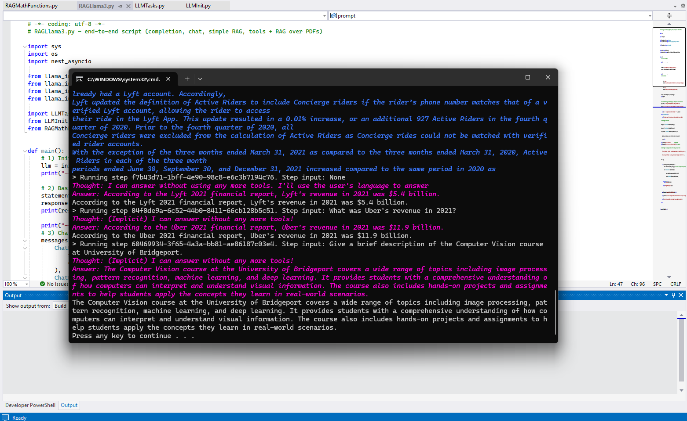
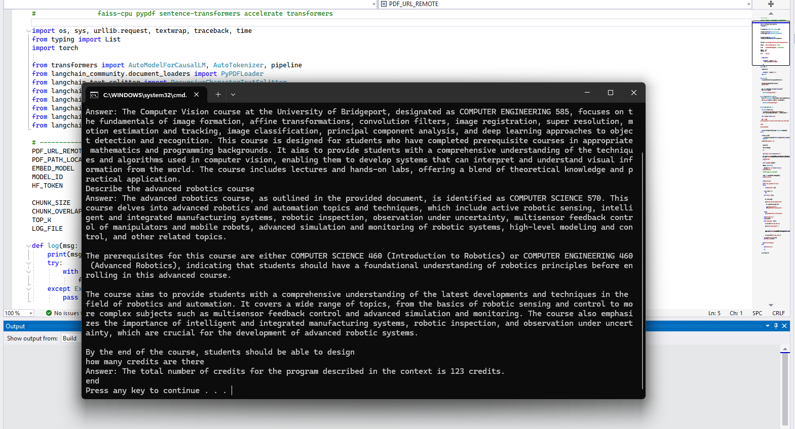
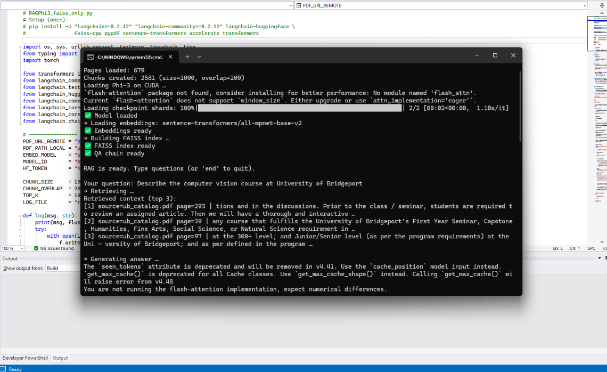

# RAG Systems Comparison
## Phi-3 (LangChain-style) vs Llama-3 (LlamaIndex-style)

This project explores **Retrieval-Augmented Generation (RAG)** by implementing the *same core idea* using **two different architectures and frameworks**. Instead of focusing on raw model performance, the goal is to understand **system design choices**, **retrieval strategies**, and **orchestration patterns** used in modern GenAI applications.

At a high level, both implementations follow the same philosophy:
> *Don’t let the language model hallucinate — ground it in retrieved knowledge.*

What differs is **how** retrieval, orchestration, and generation are wired together.

---

## What This Project Demonstrates

This repository is designed to show that you understand RAG as a **system**, not just as a buzzword. Specifically, it demonstrates:

- End-to-end RAG pipelines (document ingestion → retrieval → generation)
- Two popular GenAI stacks used in industry
- Component-level experimentation (isolating retrieval from generation)
- Secure handling of model access tokens
- Clean, reproducible project structure

---

## High-Level RAG Workflow

Both pipelines implement the following conceptual flow:

1. **Document Ingestion**  
   PDFs or text files are loaded and preprocessed.

2. **Chunking & Embeddings**  
   Documents are split into chunks and converted into vector embeddings.

3. **Vector Retrieval**  
   A similarity search retrieves the most relevant chunks for a user query.

4. **Context Injection**  
   Retrieved chunks are injected into the model prompt.

5. **Answer Generation**  
   The language model generates responses grounded in retrieved content.

---

## Repository Structure

```
rag-systems-comparison/
├── RAGPhi3/        # Phi-3 based RAG (LangChain-style pipeline)
├── RAGLlama3/      # Llama-3 based RAG (LlamaIndex-style orchestration)
├── assets/
│   └── screenshots/   # Output screenshots (added later)
├── README.md
└── requirements.txt
```

---

## RAGPhi3 – Phi-3 Pipeline (LangChain-style)

This implementation focuses on **explicit control** over the RAG pipeline.

### Key Characteristics
- Uses **Hugging Face Transformers** with Phi-3
- Local vector indexing using FAISS
- Clear separation between retrieval and generation
- Minimal abstractions — the flow is easy to trace and debug

### Scripts
- `RAGPhi3_balaji.py`  
  Full **end-to-end RAG pipeline**, intended as the primary execution script.

- `RAGPhi3_faiss_only.py`  
  A **component-level experiment** that isolates FAISS-based retrieval to study embedding quality and similarity search behavior independent of the full pipeline.

This split reflects real-world engineering practice: validate components independently before composing them into a full system.

---

## RAGLlama3 – Llama-3 Pipeline (LlamaIndex-style)

This implementation emphasizes **higher-level orchestration** using LlamaIndex abstractions.

### Key Characteristics
- Uses **LlamaIndex** for indexing and retrieval
- Demonstrates tool-style / task-based orchestration
- Better suited for complex workflows and agent-like behavior
- Shows how reasoning and retrieval can be combined in a structured way

### Scripts
- `RAGLlama3.py` – Main execution script
- `LLMInit.py` – Model initialization and configuration
- `LLMTasks.py` – Task and prompt logic
- `RAGMathFunctions.py` – Example tool-style utilities

---

## Environment Setup

### 1. Create a Virtual Environment (Recommended)

```bash
python -m venv .venv
# Windows PowerShell
.venv\Scripts\Activate.ps1
```

### 2. Install Dependencies

All required dependencies are listed in `requirements.txt`.

```bash
pip install -r requirements.txt
```

The `requirements.txt` file is intentionally kept **minimal and explicit**, derived from actual imports used in the project.

---

## Authentication (Hugging Face)

Both pipelines require access to Hugging Face models.

Tokens are read **only from environment variables** and are never hardcoded.

### Windows PowerShell
```powershell
$env:HF_TOKEN="YOUR_HF_TOKEN"
```

### macOS / Linux
```bash
export HF_TOKEN="YOUR_HF_TOKEN"
```

---

## Running the Pipelines

### Run Phi-3 RAG
```bash
python RAGPhi3/RAGPhi3_balaji.py
```

### Run Llama-3 RAG
```bash
python RAGLlama3/RAGLlama3.py
```

---

## Design Notes

- Vector indexes and generated artifacts are intentionally excluded from version control
- Sample documents are included only to demonstrate retrieval
- The project prioritizes **architectural clarity** over benchmark scores

---

## Output Screenshots

Below are selected outputs from the system runs, demonstrating how retrieval and generation work together in each pipeline.

---

### Llama-3 RAG Output (LlamaIndex Pipeline)



This output shows the LlamaIndex-based RAG pipeline using **Llama-3**, including multi-step reasoning, tool-style execution, and answers grounded in retrieved document content.

---

### Phi-3 End-to-End RAG Output



This output demonstrates the complete Phi-3 RAG pipeline, covering document ingestion, chunking, FAISS-based retrieval, and final answer generation.

---

### FAISS Retrieval Experiment (Phi-3)



This experiment isolates FAISS-based similarity search to validate embedding quality and retrieval behavior independently of the full RAG pipeline.

---

## Tech Stack

- Python
- Hugging Face Transformers
- Phi-3
- Llama-3
- LangChain-style RAG
- LlamaIndex
- FAISS (vector similarity search)

---

This project is intended as a **systems-level exploration of Retrieval-Augmented Generation**, emphasizing architectural decisions and implementation clarity over raw benchmark performance.